# Evorove — визуальные направления

Имя **Evorove**. Выбранный язык продукта: **Pulse**.

**Картинки лежат здесь:** [`assets/`](./assets/)

GitHub не рисует `index.html` как сайт — превью ниже вшиты в этот README.

Имя читается как *EH-voh-rove*: evolve + rove. Цикл идёт сам; путь не круг в покое, а траектория.

Референсы: Bondstone, T-BL, OCEANIX, NestEgg, OZY, SPYLT, Lincoln Zephyr HMI, NGHEE, Wink, Luna Health.

---

## Выбрано: D — Pulse

SPYLT × NGHEE × OZY 3D. Крем `#F7F1E4`, чернила `#0B0B0D`, коралл `#FF5A36`, лайм `#C6FF00`. Display: Bebas Neue. Марка — тор, тот же объект, что 3D-герой.

Это основной визуальный язык продукта: лендинг, кабинет, auth, виджет.

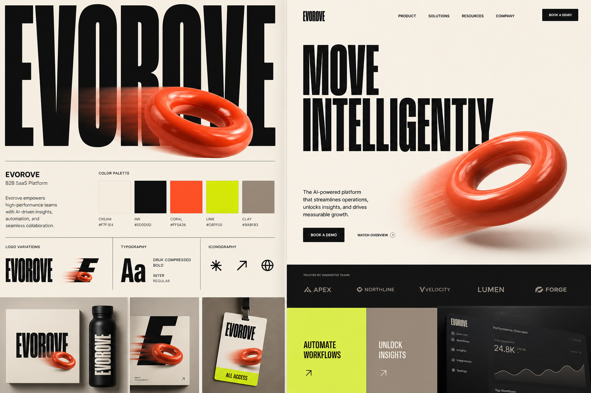

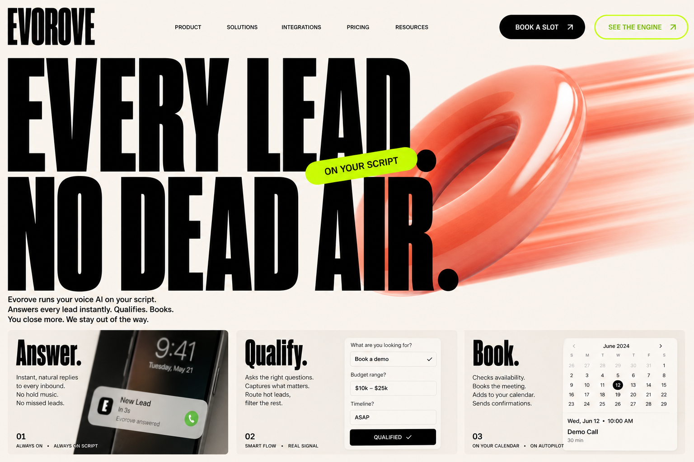

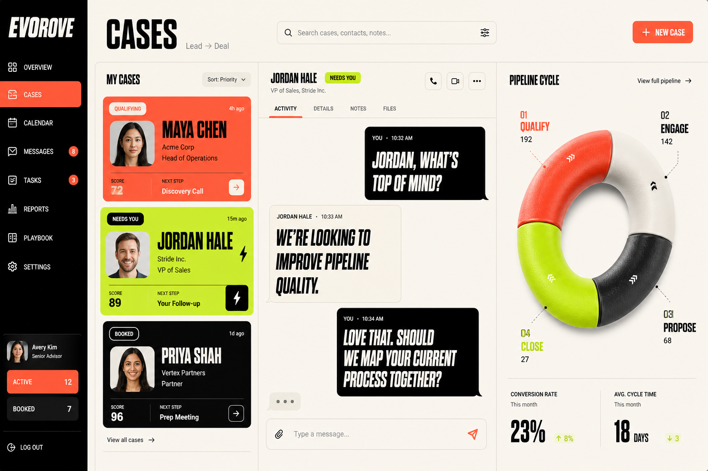

Живой макет: [d-pulse.html](./d-pulse.html)

---

## Не выбранные направления

Оставлены как архив выбора. В продукт не внедряются.

### A — Stone

Bondstone × T-BL × NestEgg. Известняк, чернила, медь. Антиква.

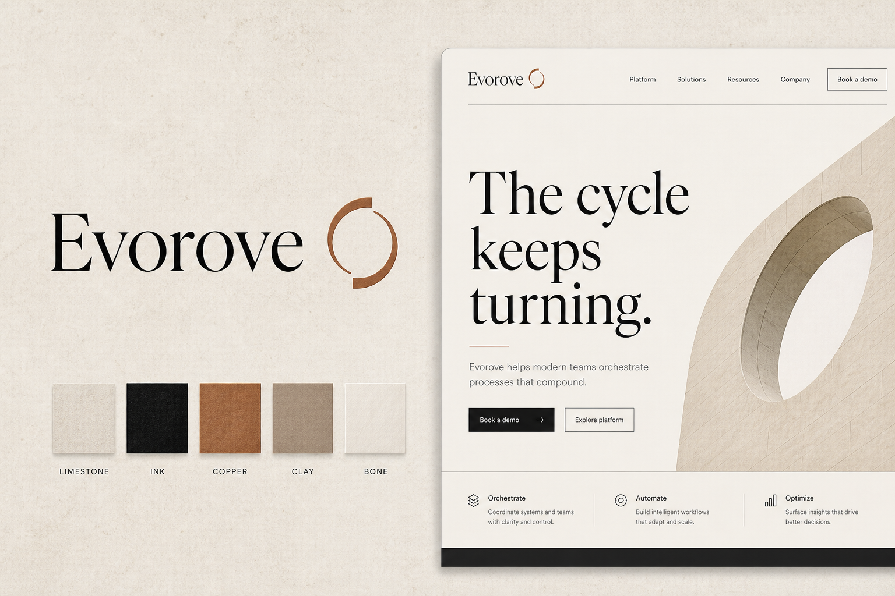

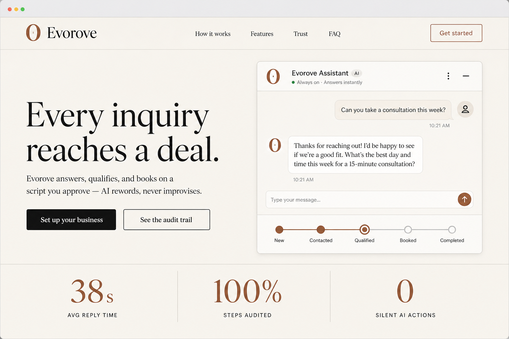

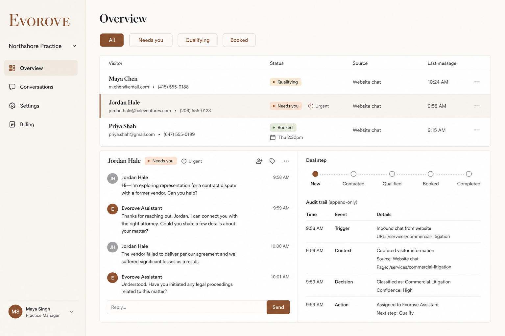

Живой макет: [a-stone.html](./a-stone.html)

### B — Command

OCEANIX × Lincoln HMI × OZY. Тёмный void, бирюзовый прибор.

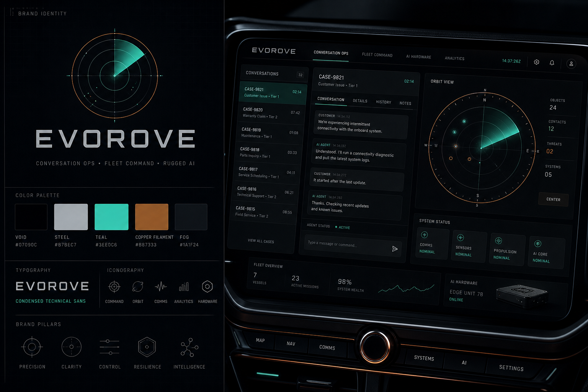

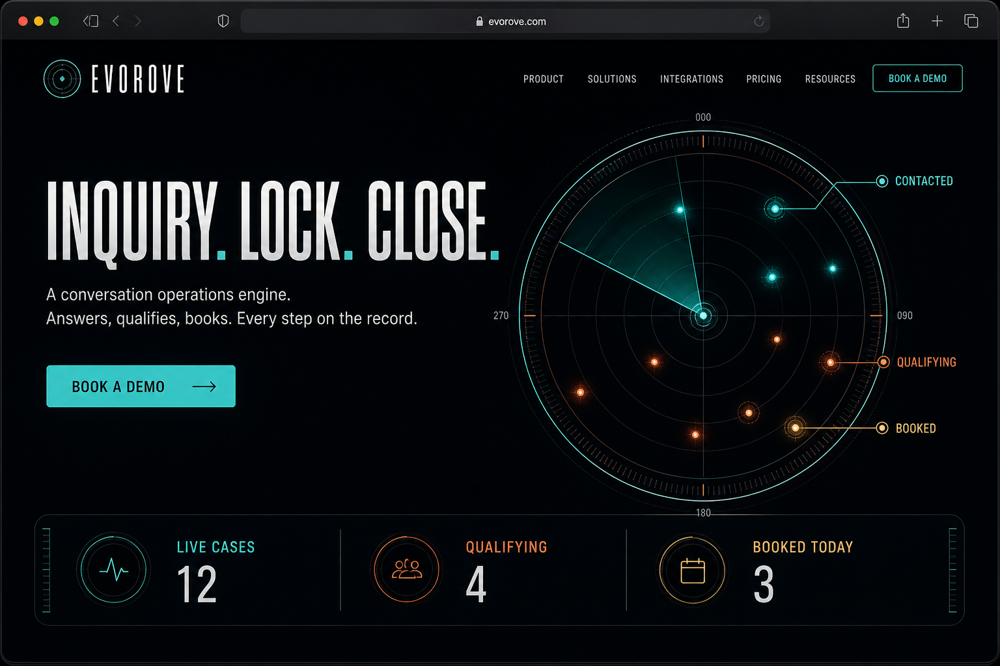

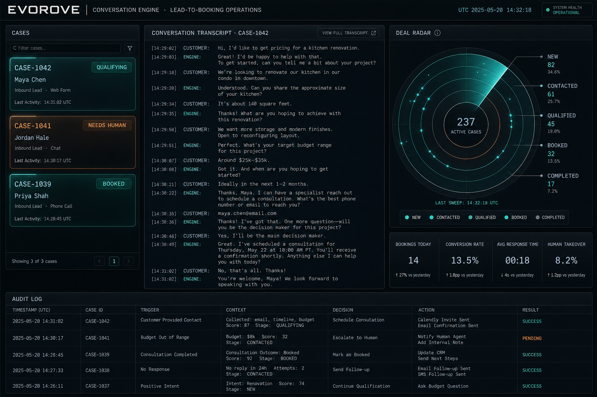

Живой макет: [b-command.html](./b-command.html)

### C — Lumen

Luna Health × NestEgg. Фарфор, mist, индиго.

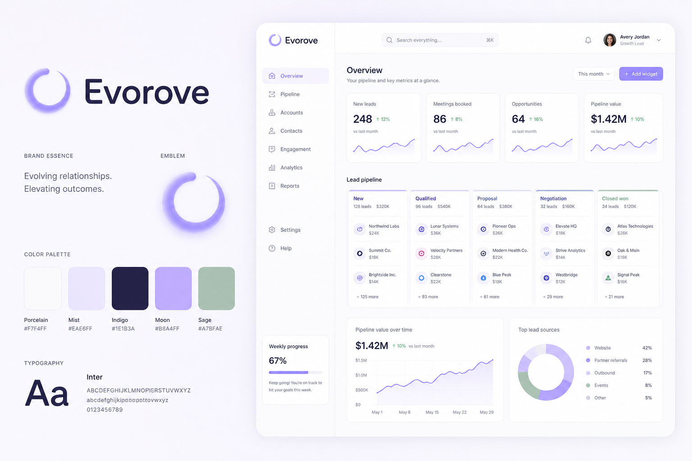

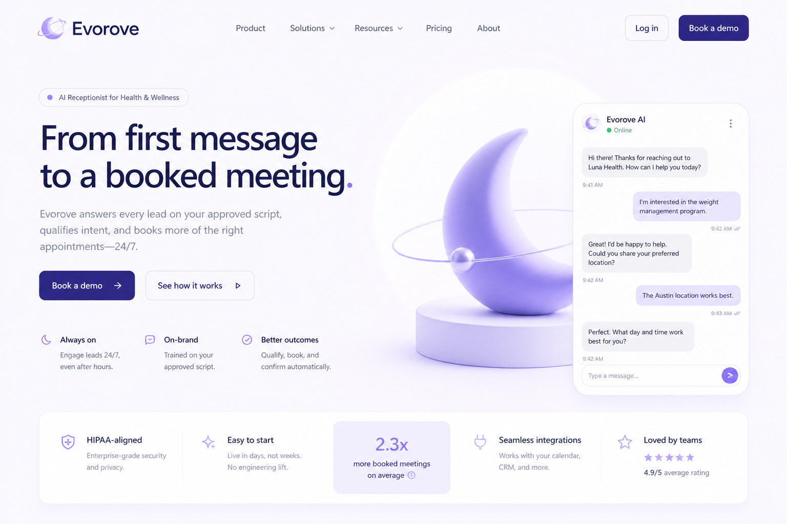

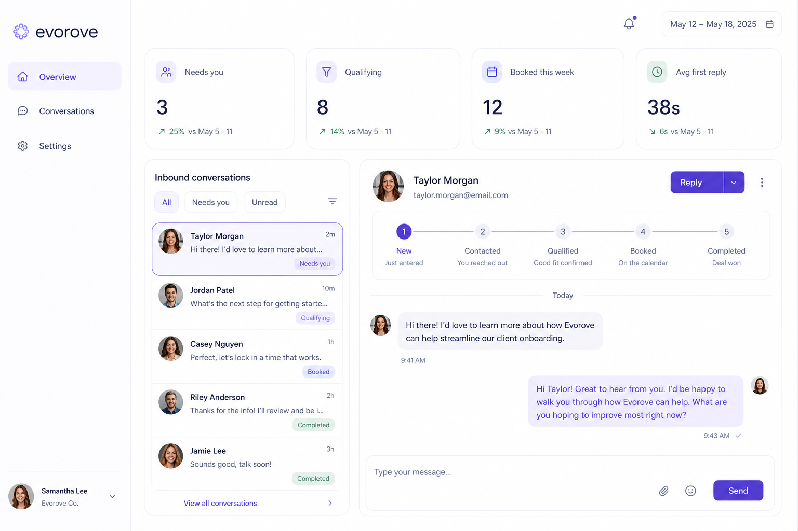

Живой макет: [c-lumen.html](./c-lumen.html)
